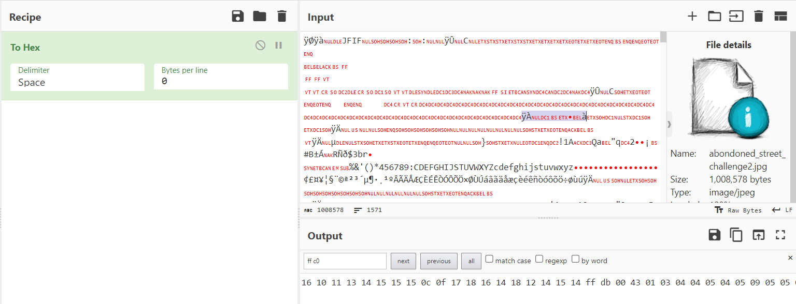
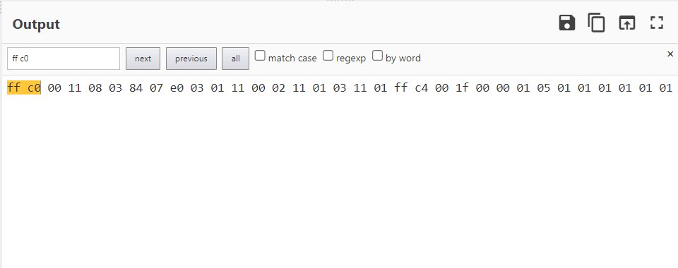

## abandoned place
The main idea finding the flag hidden inside an image which its dimension is manipulated.

#### Problem Statement:

 

#### Step-1:
Open the image inside CyberChef and convert it to hex.

#### demonistration:

 

#### Step-2:
Replace input with output in CyberChef.

#### Step-3:
Hold ctrl+F in the output field and search for ff c0. Note the following values starting at ff c0:

`ff c0 00 11 08 03 84 07 e0`

#### the relevant bytes and what they mean in the image below:

 

#### demonistration:

 

#### Step-4
I changed the bytes to :

`ff c0 00 11 08 08 84 07 e0`

#### Step-5
add "from hex" and "render image" in CyberChef operation panel and save the image

#### demonistration:

 

#### Output image will be:

 

#### The Flag is obtained:
`CTFlearn{urban_exploration}`
