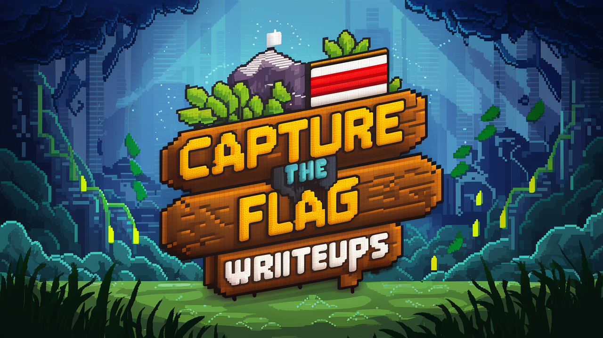

# CTF Writeups

 
<i>Writeups Challenges I have solved</i>

# CTF Writeups Repository
Welcome to the CTF Writeup Repository! This repository contains detailed writeups and solutions for various Capture The Flag challenges that i have solved. Whether you're a seasoned CTF player looking to sharpen your skills or a newcomer eager to learn, you'll find a wealth of knowledge and insights within these pages.

## License

Released under [MIT](/LICENSE) by [@Realziad](https://github.com/Realziad).
